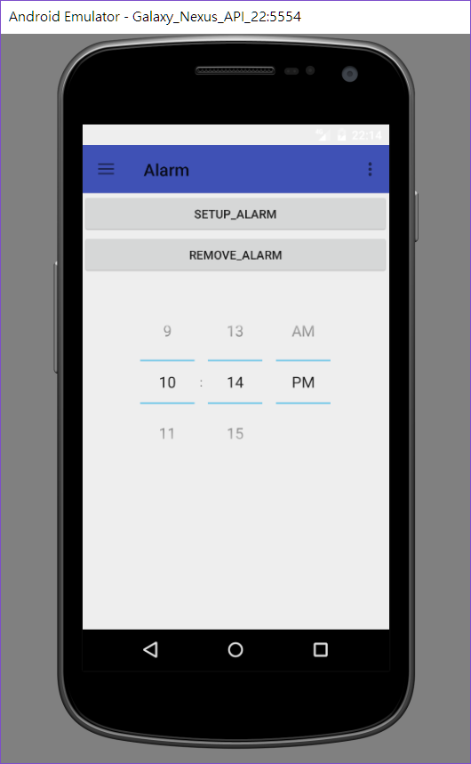

Gradle Version 2.14.1  
Android Plugin Version 2.2.2  
compileSdkVersion 24  
buildToolsVersion "21.1.1"  
minSdkVersion 15  
targetSdkVersion 24  
******************
需要功能  
1.啟動icon ( launch icon )  
2.必須：
~~~~~~~~~~~~
(1)側拉選單(Navigation Drawer) (v)
(2)選單列(menu bar) (v)未實作
(3)浮動按鈕(FAB) (v)只有實作Add
~~~~~~~~~~~~
3.至少選三樣：
~~~~~~~~~~~~
(1)ListView (v) 列出所有行程 未實作
(2)GridView (v) 在calendarView中實現
(3)動態 UI 設計(片段,Fragment) (v) 全部利用這個做動態處理
(4)Dialog Box (v) Add中多欄位Dialog
(5)Spinner (x)
(6)Picker (v) 可設定時間
~~~~~~~~~~~~
4.至少選四樣：
~~~~~~~~~~~~
(1)SQLite (v) 紀錄事項
(2)Content (x)
(3)Provider (x)
(4)Google Map (x)
(5)Notification (v) 時間到會提醒
(6)Service (v) intentService
(7)Broadcast Receiver (v) 用這個來實現行程
~~~~~~~~~~~~
******************
預覽  
  
  
  
  
************

2017/1/4  
1.上傳github：
https://github.com/ALeShengLiao/MyCalendar.git  
2017/1/3  
1.建置專案  
2.加入calendarView
**********
PS. 在markdown要\n在句末加上兩個空白
