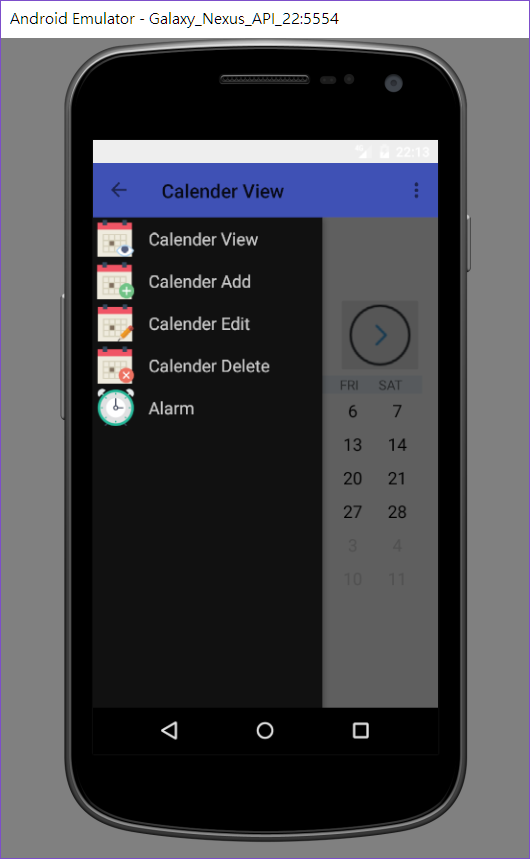
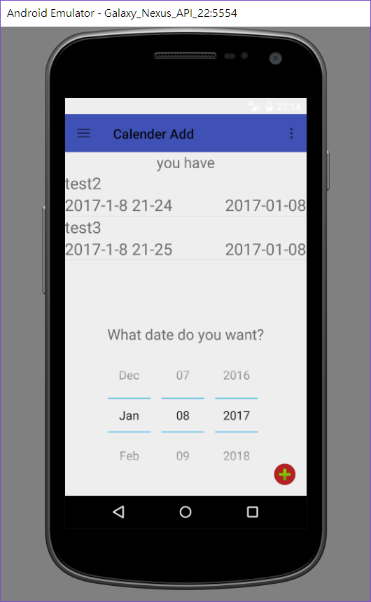

Gradle Version 2.14.1  
Android Plugin Version 2.2.2  
compileSdkVersion 24  
buildToolsVersion "21.1.1"  
minSdkVersion 15  
targetSdkVersion 24  
******************
需要功能  
1.啟動icon ( launch icon )  
2.必須：
~~~~~~~~~~~~
(1)側拉選單(Navigation Drawer) (OK)
(2)選單列(menu bar) (v)未實作
(3)浮動按鈕(FAB) (OK)
~~~~~~~~~~~~
3.至少選三樣：
~~~~~~~~~~~~
(1)ListView (OK)
(2)GridView (OK)
(3)動態 UI 設計(片段,Fragment) (OK) 全部利用這個做動態處理
(4)Dialog Box (OK)
(5)Spinner (x)
(6)Picker (OK) 可設定時間
~~~~~~~~~~~~
4.至少選四樣：
~~~~~~~~~~~~
(1)SQLite (OK) 紀錄事項 只有新增
(2)Content (x)
(3)Provider (x)
(4)Google Map (x)
(5)Notification (v) 時間到會提醒
(6)Service (v) intentService
(7)Broadcast Receiver (v) 用這個來實現行程
~~~~~~~~~~~~
******************
預覽  
  
  
  
  
************
|2017/1/8|
|---|
| 1.新增SQLite並且可以新增且顯示在FragmentDetial上  |
| 2.SQLite完成，可新增修改刪除  |
| 3.優化Fragment動態處理  |

| 2017/1/7 |
|---------------------------------|
| 1.新增FAB,ListView,Fragment |
| 2.新增通知,wakeRecevicer,picker |
| 3.更新FragmentAdd |

|2017/1/6     |
|-------------|
|1.修正錯誤   |
|2.更新drawer |

|2017/1/4 |
|-----------|
|1.上傳github：|
|https://github.com/ALeShengLiao/MyCalendar.git  |

|2017/1/3    |
|------------|
|1.建置專案  |
|2.加入calendarView  |

**********
PS. 在markdown要\n在句末加上兩個空白
